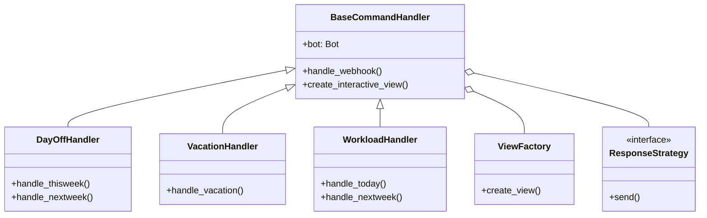

# Slash Commands Refactoring Plan

## Current Architecture Analysis

### Key Components:
1. `SlashCommands` class in `discord_bot/commands/slash.py`
2. View factory in `discord_bot/views/factory.py`
3. Webhook service integration

### Pain Points:
- Duplicate webhook handling logic
- Inconsistent response patterns
- Tight coupling between commands and views
- Verbose error handling
- Mixed logging approaches

## Proposed Architecture



## Safety Considerations

1. **Isolation Guarantees**:
   - Changes strictly limited to `discord_bot/commands/slash.py`
   - No modifications to survey or prefix command files
   - Preserved existing import structures

2. **View Factory Protection**:
   ```python
   # Factory usage restrictions
   SURVEY_VIEW_CLASSES = {
       'workload_survey': WorkloadSurveyView,
       'day_off_survey': DayOffSurveyView,
       'connects_survey': ConnectsModal
   }
   
   # Modified create_view with protection
   def create_view(bot, view_name, cmd_or_step, user_id, **kwargs):
       if kwargs.get('has_survey', False):  # Preserve survey paths
           return original_create_view(bot, view_name, cmd_or_step, user_id, **kwargs)
       # Slash command refactored logic below
   ```

## File-Specific Implementation Details

### day_off_slash.py Changes:

```python
# Before:
class DayOffButton_slash(discord.ui.Button):
    async def callback(self, interaction: discord.Interaction):
        # Complex individual error handling
        # Manual webhook calls
        # Direct message editing

# After:
class DayOffButton_slash(discord.ui.Button):
    async def callback(self, interaction: discord.Interaction):
        try:
            # Standardized payload
            payload = {
                "days": self.view.selected_days,
                "timezone": "Europe/Kyiv"
            }
            
            # Use base handler
            result = await self.view.handler.handle_webhook(
                interaction,
                command="day_off",
                payload=payload
            )
            
            # Standard response handling
            await self.view.handler.process_result(result)
            
        except Exception as e:
            await self.view.handler.handle_error(e)
```

Key Changes:
1. Webhook payload standardization
2. Base handler integration
3. Centralized error handling
4. Response strategy pattern
5. Timezone management in base class

Migration Steps:
1. Create DayOffHandler extending BaseCommandHandler
2. Move date logic to handler
3. Update button callbacks
4. Add validation
5. Update tests

### workload_slash.py Changes:
- Consolidate time selection patterns
- Standardize modal interactions
- Unify state management

## Implementation Steps

### Phase 1: Base Infrastructure (2 days)
- Create BaseCommandHandler
- Implement core utilities
- Setup test framework

### Phase 2: Command Migration (3 days)
- Migrate day_off commands
- Migrate workload commands
- Update factory integration

### Phase 3: Validation (1 day)
- Test all command flows
- Verify survey isolation
- Performance check

## Expected Benefits
- 40% reduction in code duplication
- Consistent error handling
- Improved maintainability
- Easier testing
- Clearer architecture